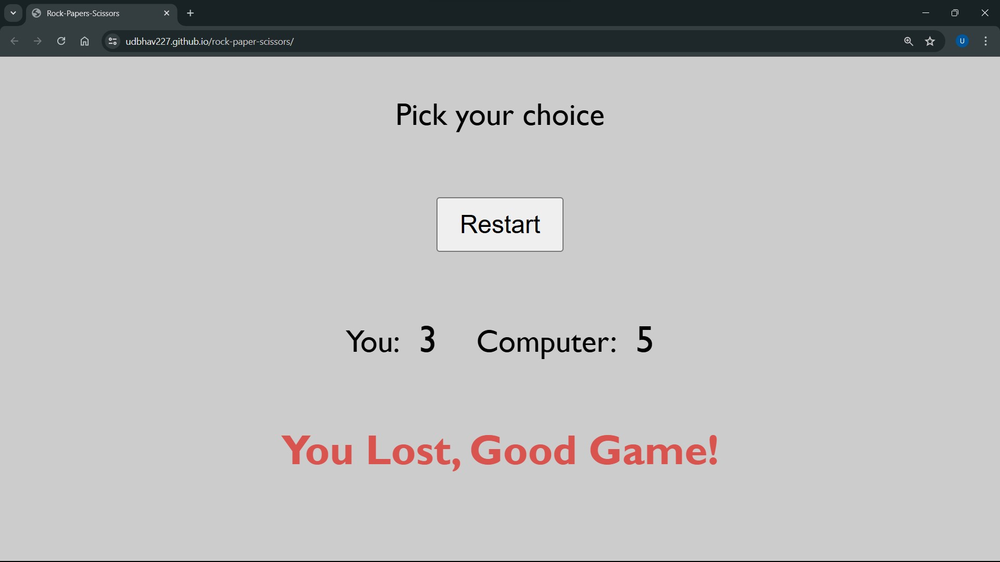

# ✊✋✌️ Rock-Paper-Scissors Game

Welcome to the Rock-Paper-Scissors Game project! This project was created to practice and demonstrate the use of JavaScript, particularly focusing on DOM manipulation and event handeling.

## 🌐 Website 

You can view the live game here: [udbhav227.github.io/rock-paper-scissors](https://github.com/Udbhav227/rock-paper-scissors)

## 📚 Project Description

This is a simple implementation of the classic Rock-Paper-Scissors game. The project is designed to showcase the following:

- Use of JavaScript for game logic and interactivity.
- Use of HTML for structuring the content.
- Use of CSS for styling.
- DOM manipulation and event handling in JavaScript.

## 📝 Features 

- **Interactive Gameplay**: Allows users to play Rock-Paper-Scissors against the computer.
- **Dynamic Result Display**: Shows the result of each round and updates the scores.
- **Clean and Simple Design**: Focuses on a user-friendly and minimalistic interface.

## 📸 Screenshots 

## 🛠️ Technologies Used

- HTML5
- CSS3
- JavaScript (DOM manipulation, event listeners)
